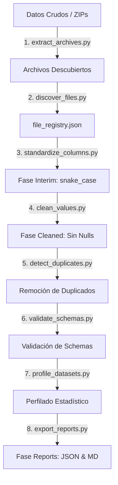

# Pipeline de Normalización de Datasets (`backend/normalization`)

Este módulo proporciona un pipeline robusto, modular y reproducible para el descubrimiento, limpieza, perfilado y clasificación de datasets experimentales de impresión 3D y ensayos mecánicos.

El pipeline transforma datos en bruto altamente heterogéneos en conjuntos de datos limpios y listos para ser modelados por algoritmos de Machine Learning.

---

## 🔄 Flujo del Pipeline (Arquitectura de Datos)

El pipeline de normalización procesa los datos en fases secuenciales:



---

## 📁 Estructura del Módulo

*   `run_pipeline.py`: Script orquestador principal que ejecuta secuencialmente todas las fases.
*   `requirements.txt`: Dependencias específicas de Python requeridas (ej. `pandas`, `numpy`, `scipy`).
*   `config/`: Configuración del inventario e historial de archivos registrados (`file_registry.json`).
*   `interim/`: Almacenamiento intermedio de archivos con columnas estandarizadas en `snake_case`.
*   `cleaned/`: Carpeta final con conjuntos de datos listos para el entrenamiento de ML, libres de valores atípicos y nulos.
*   `reports/`: Informes de perfilado en formato JSON y resúmenes de viabilidad de los datos en Markdown.
*   `logs/`: Registro detallado de errores y operaciones durante la ejecución (`pipeline.log`).
*   `src/`: Módulos de lógica especializados:
    *   `extract_archives.py`: Extracción automática de ficheros comprimidos y organización inicial.
    *   `discover_files.py`: Escaneo y registro de fuentes de datos.
    *   `standardize_columns.py`: Mapeo de columnas, traducción de sinónimos de ingeniería (ej. `Tensile` -> `tension_strenght`) y formato en `snake_case`.
    *   `clean_values.py`: Imputación o eliminación de valores nulos, recorte de espacios, y normalización de tipos numéricos.
    *   `detect_duplicates.py`: Identificación y eliminación de filas repetidas en series de ensayos.
    *   `validate_schemas.py`: Validación estricta contra esquemas de columnas y tipos esperados.
    *   `profile_datasets.py`: Análisis estadístico descriptivo preliminar del dataset.
    *   `export_reports.py`: Formateo de los hallazgos en informes finales de calidad.

---

## 🚀 Uso y Ejecución

Para iniciar el pipeline completo desde la raíz del proyecto, ejecuta:

```bash
# Activar entorno virtual primero
& .venv\Scripts\activate

# Ejecutar el orquestador
python backend/normalization/run_pipeline.py
```

O si te encuentras dentro del directorio `backend/normalization`:

```bash
python run_pipeline.py
```

## ⚙️ Reglas de Limpieza Clave

1.  **snake_case**: Todos los nombres de columnas de entrada se transforman a minúsculas, reemplazando espacios e iconos especiales por barras bajas (`_`).
2.  **Imputación de Nulos**: Las columnas numéricas críticas con pocos nulos se completan usando la mediana del grupo, mientras que registros severamente corruptos o vacíos se descartan explícitamente.
3.  **Filtrado de Dominio**: Se descartan columnas sin señal física relevante o que violen la delimitación del modelo (ej. datos de tracción para simulaciones puramente compresivas).
