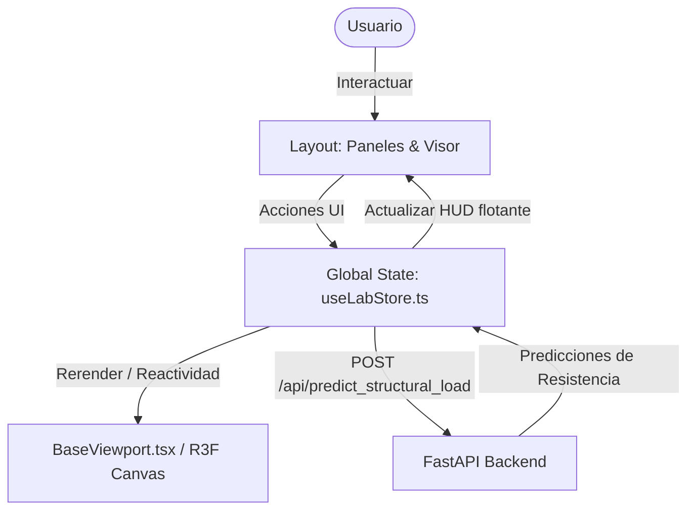

# MaterialForge Frontend Client (`frontend`)

Este es el cliente web e interfaz interactiva de **MaterialForge**, una plataforma CAD/CAE de nivel industrial para el diseño, simulación y optimización de probetas 3D con estructuras celulares (TPMS/Lattices).

La interfaz está diseñada bajo el estándar estético de herramientas profesionales del sector (como Blender y OrcaSlicer), con paneles compactos, baja fatiga ocular y un visor 3D central interactivo de alto rendimiento.

---

## 🎨 Arquitectura del Interfaz Web

El cliente está estructurado como una Single Page Application (SPA) modular en Next.js, sincronizando la geometría 3D local con las predicciones del backend en tiempo real:



---

## 🚀 Capacidades Clave

1.  **Visor 3D Interactivo (React Three Fiber & Three.js)**:
    *   Fondo de estudio claro (#FAFBFC) para visibilidad óptima de struts y perfiles del filamento.
    *   Modos de visualización dinámicos: *Sólido*, *Sección Transversal (Z-Slicing)* y *Stress/Heatmap (Simulación de Compresión)*.
    *   Gestión inteligente de recursos WebGL (`.dispose()`) en materiales y geometrías para prevenir fugas de VRAM.
2.  **Panel Paramétrico Izquierdo (LeftPanel)**:
    *   **Geometría**: Controles numéricos y sliders con unidades físicas explícitas (Dimensiones en `cm`, espesor de pared y altura de capa en `mm`).
    *   **Material**: Perfiles integrados de termoplásticos comunes (PLA, TPU, ABS, PETG) con visualización de propiedades elásticas.
    *   **Infill (TPMS/Lattices)**: Configuración matemática de celdas (Gyroid, Honeycomb, Schwarz P), tamaño de celda y densidad de infill.
3.  **Panel de Análisis y Predicción Derecho (RightPanel)**:
    *   **Métricas del Slicer**: Masa estimada, densidad relativa y tiempo de impresión computado dinámicamente.
    *   **Propiedades Mecánicas**: Resistencia de fluencia (MPa), fuerza de colapso teórica (N) y rigidez estimada mediante los modelos de regresión del backend.
    *   **Límites de Seguridad**: Alertas visuales contextuales si la pieza excede los rangos seguros del material o las dimensiones máximas.
4.  **Copiloto de IA Integrado (AISidebar)**:
    *   Panel de chat flotante conectado a modelos de LLM locales (vía Ollama).
    *   Habilidad para interpretar sugerencias paramétricas enviadas en formato JSON por el agente y aplicarlas instantáneamente al editor con un solo clic.

---

## 🛠️ Tecnologías Utilizadas

*   **Framework**: Next.js 15 (App Router) y TypeScript.
*   **Motor 3D**: Three.js, React Three Fiber (R3F) y `@react-three/drei`.
*   **Manejo de Estado**: Zustand (`useLabStore.ts`) para una reactividad desacoplada e instantánea sin re-renders masivos del DOM.
*   **Gráficos Estadísticos**: Recharts (para curvas de esfuerzo y diagramas de compresión).
*   **Estilos**: Tailwind CSS con paleta técnica optimizada y animaciones fluidas para modales.

---

## 💻 Desarrollo e Instalación

Para instalar y correr el servidor de desarrollo del frontend localmente:

### 1. Instalar dependencias
```bash
cd frontend
npm install
```

### 2. Ejecutar el servidor dev
```bash
npm run dev
```

El cliente web estará disponible en:
👉 [http://localhost:3000](http://localhost:3000)

*Nota: Asegúrate de tener el backend de FastAPI ejecutándose en el puerto `8000` para que las llamadas de predicción geométrica y estructural funcionen correctamente.*
