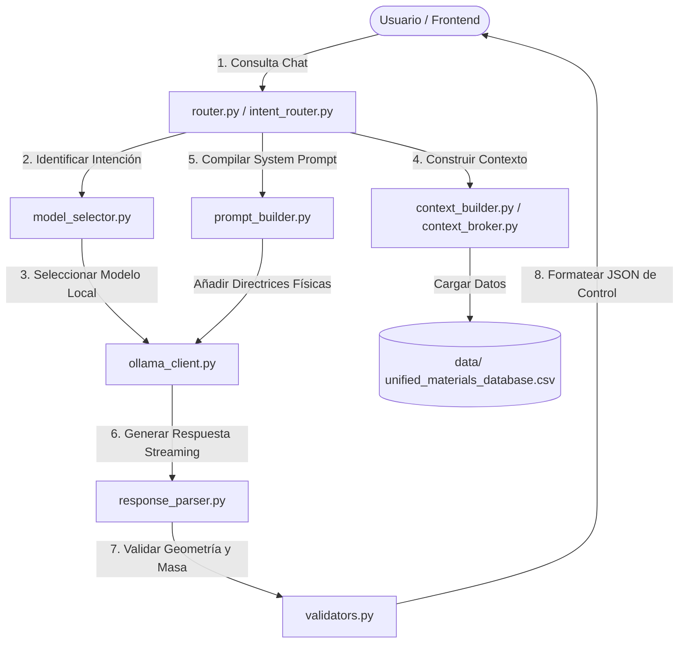

# Motor de Copiloto de IA (`ia_agent`)

Este directorio contiene la arquitectura del **Copiloto Científico de IA (MaterialForge Copilot)**. Es un agente conversacional y de razonamiento físico diseñado para ejecutarse localmente con **Ollama** u otros motores de inferencia. Actúa como asesor experto en ciencia de materiales (PLA, TPU), diseño aditivo en impresión 3D FDM y optimización topológica.

---

## 🏗️ Arquitectura del Agente de IA

El módulo está estructurado como un pipeline modular de Procesamiento de Lenguaje Natural (NLP) e inferencia física:



---

## 📁 Estructura del Framework del Agente

El framework se compone de los siguientes elementos clave:

### Componentes de Inferencia y API:
*   `copilot.py`: Punto de entrada HTTP y orquestador del flujo conversacional asíncrono.
*   `ollama_client.py`: Cliente de bajo nivel para interactuar con la API local de Ollama (`http://localhost:11434`), con soporte de streaming NDJSON.
*   `model_selector.py`: Lógica inteligente para detectar y priorizar modelos locales (ej. `qwen2.5-coder:3b`, `llama3.2:3b`, `gemma:2b`).
*   `schemas.py`: Modelos de validación e intercambio de datos basados en `pydantic` (ej. `CopilotChatPayload`).

### Componentes de Lógica Conversacional y RAG:
*   `router.py` / `intent_router.py`: Enrutador central que decide si el prompt del usuario requiere una consulta bibliográfica (RAG), optimización matemática, o una respuesta conversacional general.
*   `context_builder.py` / `context_broker.py`: Creadores de contexto enriquecido. Leen la base de datos de probetas reales y ensamblan el historial del chat.
*   `prompt_builder.py`: Compilador del *System Prompt*, inyectando las directrices de ingeniería obligatorias y el formato de salida estructurado.
*   `response_parser.py`: Parser en tiempo real de la respuesta del modelo, que separa el texto explicativo de las recomendaciones estructuradas en formato JSON.

### Componentes de Reglas de Ingeniería:
*   `validators.py`: Filtros de validación que verifican que las recomendaciones de la IA se adhieran a los límites físicos del proyecto (volumen máximo de $125\text{ cm}^3$, peso bajo $100\text{ g}$, formas permitidas y parámetros de pared realistas).

---

## ⚙️ Directrices Físicas Custodiadas

El agente está configurado para no violar los límites físicos del equipo de impresión y del estudio:
1.  **Límite de Tamaño**: Piezas restringidas a un cubo envolvente de máximo $5.0 \times 5.0 \times 5.0\text{ cm}$.
2.  **Límite de Peso**: Masa teórica calculada inferior a $100\text{ gramos}$.
3.  **Librería Geométrica**: Geometrías limitadas a formas analizables (Cubo, Esfera, Cilindro, Cono, Toro, Pirámide, Prisma Hexagonal).
4.  **Generación de JSON**: Las recomendaciones paramétricas se traducen a un formato JSON estándar que el frontend puede aplicar al canvas 3D con un solo clic.

---

## 🚀 Requisitos e Integración

### 1. Levantar Ollama Localmente
Asegúrate de tener un modelo instalado y corriendo en tu máquina:
```bash
ollama run qwen2.5-coder:3b
```

### 2. Uso en Endpoints FastAPI
El framework se puede acoplar fácilmente en un endpoint HTTP asíncrono:

```python
from fastapi import FastAPI
from fastapi.responses import StreamingResponse
from ia_agent.copilot import CopilotChatPayload, run_copilot_stream

app = FastAPI()

@app.post("/api/copilot/chat")
async def chat_endpoint(payload: CopilotChatPayload):
    return StreamingResponse(
        run_copilot_stream(payload), 
        media_type="application/x-ndjson"
    )
```
